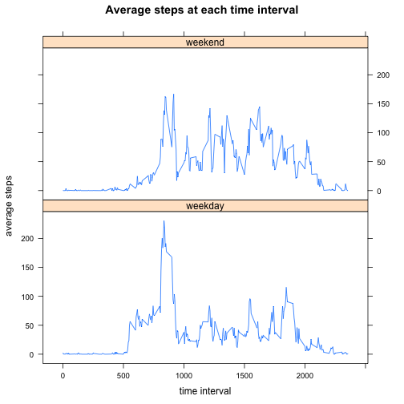

# Reproducible Research: Peer Assessment 1

## Loading and preprocessing the data

The data is loaded into R from the "activity.csv" file.  The only processing performed is to convert the date character string to a proper date type.

```r
data <- read.csv("activity.csv", header=TRUE, colClasses=c("numeric", "character", "numeric"), na.strings="NA")
#data$date <- strptime(data$date, format="%Y-%m-%d") #convert data column to date data type
data$date <- as.POSIXct(data$date, format="%Y-%m-%d") #convert data column to date data type
head(data, n=4) #show sample data
```

```
##   steps       date interval
## 1    NA 2012-10-01        0
## 2    NA 2012-10-01        5
## 3    NA 2012-10-01       10
## 4    NA 2012-10-01       15
```

```r
tail(data, n=4) #show sampel data
```

```
##       steps       date interval
## 17565    NA 2012-11-30     2340
## 17566    NA 2012-11-30     2345
## 17567    NA 2012-11-30     2350
## 17568    NA 2012-11-30     2355
```

## What is mean total number of steps taken per day?
To calculate this, we will first look at the total number of steps taken each day.  The following historgram shows the frequency of step totals that occured during the sample period.

```r
byDaySumData <- aggregate(data$steps ~ data$date, FUN=sum)
names(byDaySumData) <- c("date", "stepsSum") #create cleaner names for the new data frame
hist(byDaySumData$stepsSum, breaks=20, xlab="total steps", main="Frequency of daily total steps")
```

 

The mean of the total values is

```r
mean(byDaySumData$stepsSum)
```

```
## [1] 10766
```

the median of the total values is

```r
median(byDaySumData$stepsSum)
```

```
## [1] 10765
```

## What is the average daily activity pattern?
To determine the daily activity pattern, we need to look at the average number of steps taken at each point of the day across all days in the sample period.

```r
byIntervalData <- aggregate(data$steps ~ data$interval, FUN=mean)
names(byIntervalData) <- c("interval", "stepsMean") #create cleaner names for the new data frame
plot(byIntervalData$interval, byIntervalData$stepsMean, type="l", xlab="time interval", ylab="average steps", main="Average steps at each time interval")
```

 

Based on this data, the highest average number of steps occurred at the following time interval

```r
# max() finds the largest value. Match() finds the index of where that value is. [] references the data frame by the index.
byIntervalData$interval[match(max(byIntervalData$stepsMean), byIntervalData$stepsMean)]
```

```
## [1] 835
```

## Imputing missing values
The following shows the number of missing values in the source data

```r
# complete.cases() returns a logical array. True has a value of 1.  False has a value of 0. The sum() gives the total number of trues.
sum(!complete.cases(data))
```

```
## [1] 2304
```

We need to develop a strategy to deal with this missing data.  For this report, I will replace missing values with the average number of steps for all the other days for the same time interval.  This assumes the days with the missing data are similar to the days where the data is present.

```r
# Merge the original data frame with the average values by interval calculated above.  This results in a new column added to the original data with the mean number of steps for that time interval
fixedData <- merge(data, byIntervalData, by.x="interval", by.y="interval", all=FALSE)
# After the merge, restore the original sort order of data first and interval second.
fixedData <- fixedData[order(fixedData$date, fixedData$interval),]; #restore the original order of sorting
# If a step value is NA, replace it with the mean step value in the same row (interval match was done in the merge above)
fixedData$steps[is.na(fixedData$steps)] <- fixedData$stepsMean[is.na(fixedData$steps)]
```

Here is a sample of some of the data in the new data frame.  The observations on 2012-10-07 are recorded as 0.0 so the steps show that value.  The observations on 2012-10-08 are recorded as NA so they are assigned the same value as mean steps (stepsMean) for that interval.

```r
fixedData[2014:2019,] #show sample data
```

```
##       interval  steps       date stepsMean
## 17428     2345 0.0000 2012-10-07    0.6415
## 17484     2350 0.0000 2012-10-07    0.2264
## 17564     2355 0.0000 2012-10-07    1.0755
## 58           0 1.7170 2012-10-08    1.7170
## 89           5 0.3396 2012-10-08    0.3396
## 159         10 0.1321 2012-10-08    0.1321
```

With the missing data now filled in, we can repeat some of the earlier data analysis. The following historgram shows the frequencty of step totals that occured during the sample period.  

```r
byDaySumFixedData <- aggregate(fixedData$steps ~ fixedData$date, FUN=sum)
names(byDaySumFixedData) <- c("date", "stepsSum") #create cleaner names for the new data frame
hist(byDaySumFixedData$stepsSum, breaks=20, xlab="total steps", main="Frequency of daily total steps")
```

 

The mean of the total values is

```r
mean(byDaySumFixedData$stepsSum)
```

```
## [1] 10766
```

the median of the total values is

```r
median(byDaySumFixedData$stepsSum)
```

```
## [1] 10766
```

Compared to the original unmodified data, the histogram, mean, and median produce nearly identical results.

## Are there differences in activity patterns between weekdays and weekends?

To determine the difference in weekday and weekend activity, I add a two level factor variable to the data frame.


```r
fixedData$dayOfWeek <- weekdays(fixedData$date); # append a column to record the day of week
fixedData$partOfWeek <- "weekday"  # append a colum with the part of week. Initially assume weekday but that needs to be fixed for weekend days
# For all records with a "Saturday" or "Sunday" dayOfWeek, replace the partOfWeek with the factor variable "weekend" 
fixedData$partOfWeek[fixedData$dayOfWeek %in% c("Saturday", "Sunday")] <- "weekend"
fixedData$partOfWeek <- as.factor(fixedData$partOfWeek) # convert partOfWeek to factor class type
```

Here is a sample of some of the data in the new data frame.  The dayOfWeek and partOfWeek show the correct value for the corresponding date.

```r
fixedData[2014:2019,] #show sample data
```

```
##       interval  steps       date stepsMean dayOfWeek partOfWeek
## 17428     2345 0.0000 2012-10-07    0.6415    Sunday    weekend
## 17484     2350 0.0000 2012-10-07    0.2264    Sunday    weekend
## 17564     2355 0.0000 2012-10-07    1.0755    Sunday    weekend
## 58           0 1.7170 2012-10-08    1.7170    Monday    weekday
## 89           5 0.3396 2012-10-08    0.3396    Monday    weekday
## 159         10 0.1321 2012-10-08    0.1321    Monday    weekday
```

We can then use the weekend data to calculate the average number of steps across the time interval for both weekend and weekday periods

```r
byIntervalWeekendData <- aggregate(fixedData$steps ~ fixedData$interval + fixedData$partOfWeek, FUN=mean)
names(byIntervalWeekendData) <- c("interval", "partOfWeek" ,"stepsMean") #create cleaner names for the new data frame
```

Finally, here is a plot comparing the average steps across weekdays versus weekends

```r
library(lattice)
xyplot(stepsMean ~ interval | partOfWeek, data = byIntervalWeekendData, layout = c(1,2), type="l", xlab="time interval", ylab="average steps", main="Average steps at each time interval")
```

 


